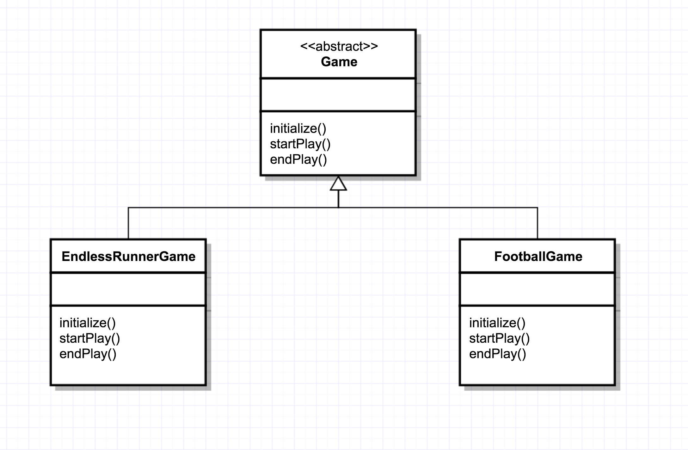
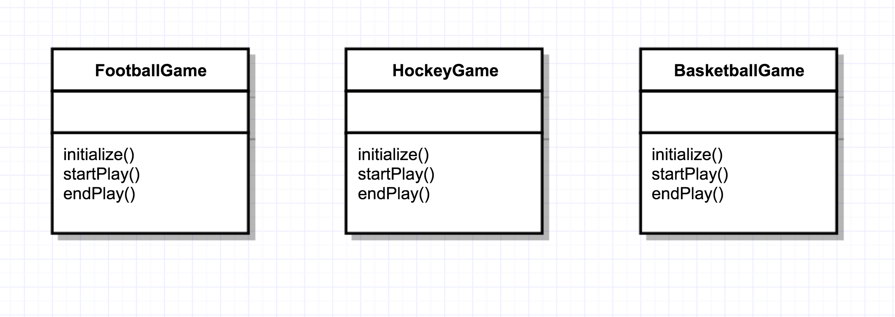

## The Template Design Pattern

 The Template defines the skeleton of an algorithm in a method deferring some steps to subclasses.
It also lets subclasses define certain steps of an algorithm without changing the algorithms structure again.

  <b> Essentially, what are we doing? </b>

We are abstracting out or encapsulating the main algorithms so that the children can actually use those
algorithms and tweak as they go as well.
So we get rid of redundancy and repetition. 

1. First Code Resource  

2. Second Code Resource

